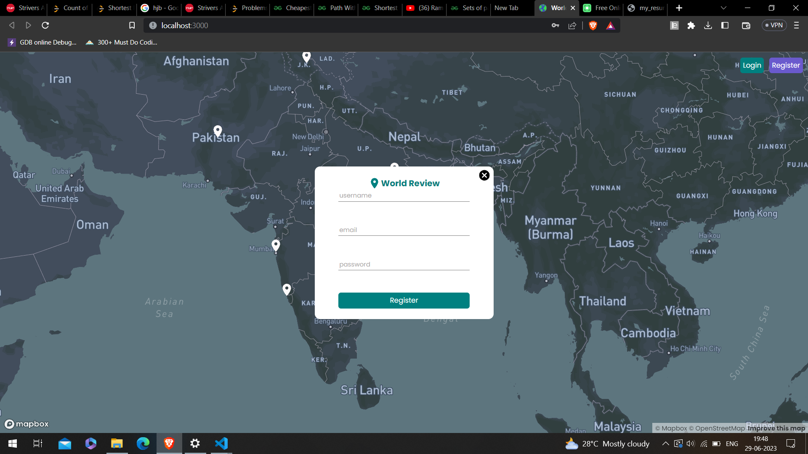
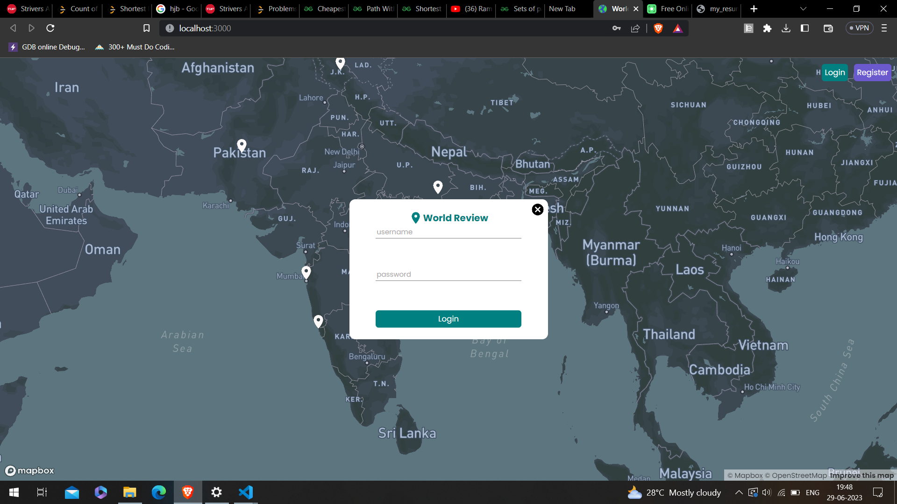
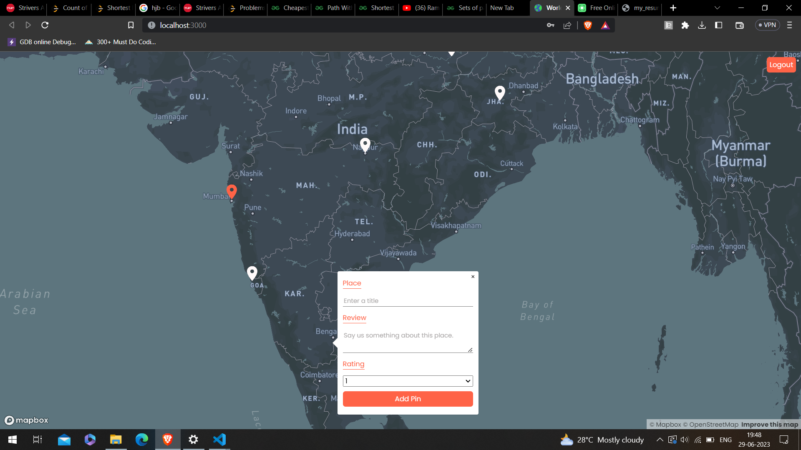
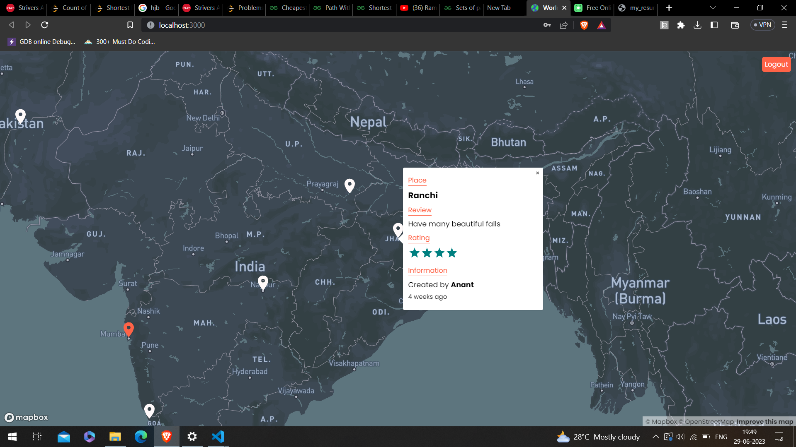
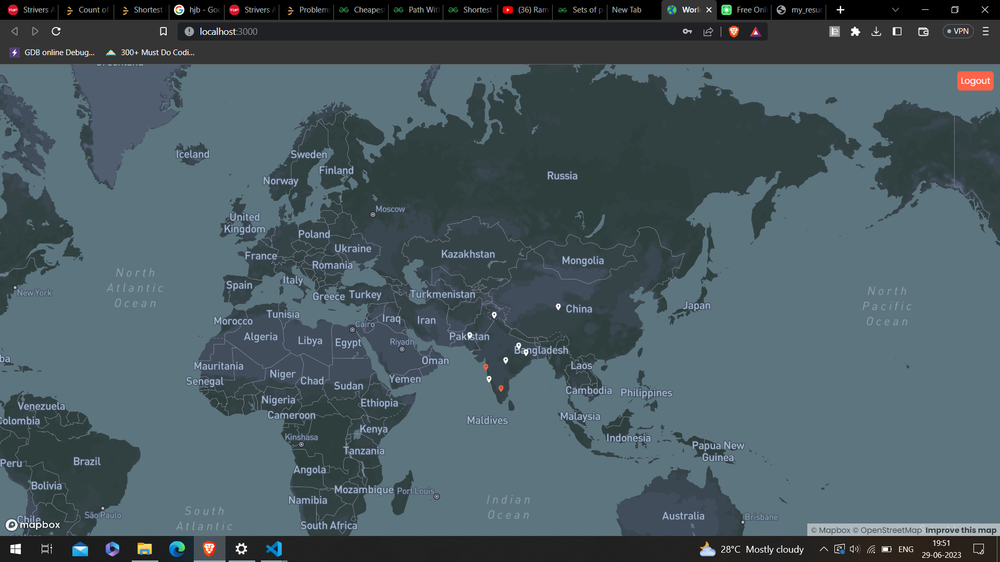

# World Review

## Introduction:
- Tech Stack – React, NodeJs, Express, MongoDB

- A map marker for its review and rating on real time map by Mapbox API 

- World Review allows users to see the review and rating of other people on that place which help to know the  pros and cons of that place.

## Technology Stack:
  1) MongoDB
  2) Mapbox API
  3) ReactJS
  4) ExpressJS
  5) NodeJS
  
  
## Screenshots

### Created By- SHASHANK SHEKHAR